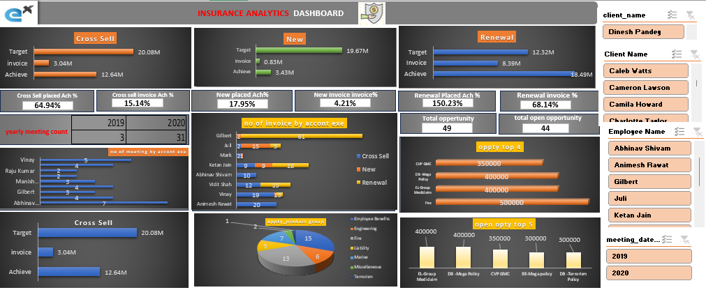

# 📊 Insurance Analytics Dashboard

This project showcases an Excel-based dashboard developed to analyze insurance sales performance, track employee productivity, and monitor sales opportunities across Cross Sell, New, and Renewal segments.

## 🔍 Overview

The dashboard provides key metrics and insights into:

- **Sales Performance**
  - Comparison of Target vs. Achieved Invoices
  - Achievement % across Cross Sell, New Business, and Renewals
  - Renewal performance exceeded expectations with 150.23% target achievement

- **Employee Performance**
  - Year-wise meeting count (2019 & 2020) by account executives
  - Invoice distribution by executive across all policy types
  - Top contributors: Gilbert, Abhinav Shivam, and Ketan Jain

- **Opportunities Tracking**
  - Total Opportunities: 49  
  - Open Opportunities: 44  
  - High-value opportunities like PMS (₹500K) and DB Group MedClaim (₹400K)

- **Product Insights**
  - Distribution of applications/policies by product group shown via a 3D pie chart

- **Interactive Filters**
  - Slicers for Client Name, Employee Name, and Meeting Dates enable dynamic filtering

## 📎 Tools Used

- **Microsoft Excel**
- Pivot Tables & Charts
- Power Query
- Slicers and Data Visualization

## 📌 Key Outcomes

- Renewal segment exceeded targets significantly
- Identified top-performing employees based on meetings and invoices
- Exposed underperformance in new business segment
- Highlighted high-value sales opportunities

## 📸 Preview

---

> 🚀 This project demonstrates practical data analysis, dashboarding, and Excel automation skills — great for sales analytics, performance tracking, and decision-making in the insurance sector.

