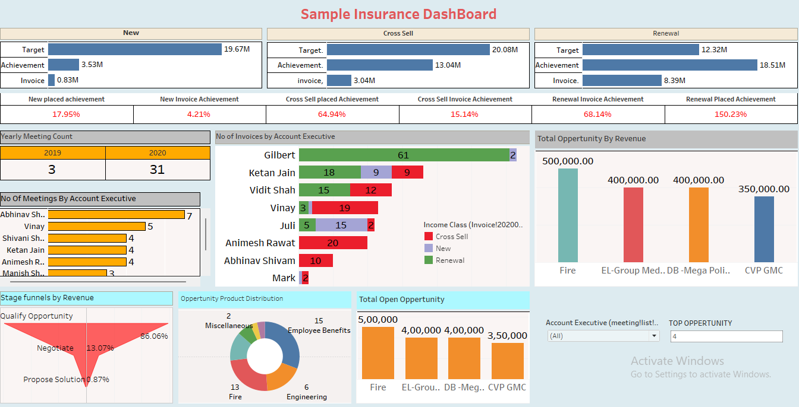

# 📊 Sample Insurance Dashboard (Tableau-style)

This dashboard provides a strategic visualization of insurance sales performance, employee activity, and opportunity funnel management. Built using Excel with Tableau-style design elements, it highlights the effectiveness of Cross Sell, New Business, and Renewal efforts across various metrics.

## 🔍 Dashboard Features

### 🔹 Sales Performance Summary
- **New Business**
  - 🎯 Target: ₹19.67M | 📈 Achievement: ₹3.53M | 💰 Invoice: ₹0.83M
  - 📊 New Placed Achievement: 17.95% | Invoice Achievement: 4.21%

- **Cross Sell**
  - 🎯 Target: ₹20.08M | 📈 Achievement: ₹13.04M | 💰 Invoice: ₹3.04M
  - 📊 Placed Achievement: 64.94% | Invoice Achievement: 15.14%

- **Renewal**
  - 🎯 Target: ₹12.32M | 📈 Achievement: ₹18.51M | 💰 Invoice: ₹8.39M
  - 📊 Placed Achievement: 150.23% | Invoice Achievement: 68.14%

---

### 🧑‍💼 Employee Analytics
- 📅 Yearly Meeting Count:  
  - 2019: 3 meetings | 2020: 31 meetings
- 👥 Meeting distribution by Account Executive
  - Top performer: **Abhinav Shivam (7 meetings)**

- 📦 Invoice Count by Executive (with policy type breakdown)
  - Leading: **Gilbert (61 Renewal invoices)**, **Ketan Jain**, **Vidit Shah**

---

### 📈 Opportunity Insights
- **Revenue by Top Opportunities**
  - Fire: ₹500K  
  - EL-Group Med: ₹400K  
  - DB-Mega Policy: ₹400K  
  - CVP GMC: ₹350K

- **Stage Funnel by Revenue**
  - 86% at Qualify Opportunity stage  
  - 13% at Negotiate  
  - 0.87% at Proposal

- **Opportunity Product Distribution**
  - Key segments: Fire, Engineering, Employee Benefits

---

## ⚙️ Tools Used
- Microsoft Excel (Dashboard Design)
- Tableau Design Principles
- Charts, Bar Graphs, Pie Charts, Funnels
- Interactive Filters and Visual Cues

---

## 📸 Dashboard Preview

---

> 🚀 This dashboard enables managers and analysts to monitor sales efficiency, evaluate employee productivity, and spot high-value opportunities in the insurance domain — using a clean, intuitive design.
